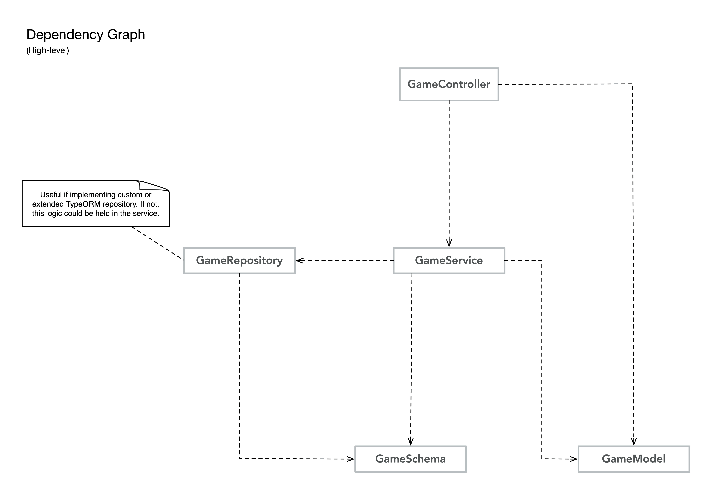

# Motivations

This excercise has evolved into the design of boilerplate for a dream TypeScript API stack.
Certain design decisions have been made with extensibility and scale in mind for larger applications.

# Running

* ** run notes and docker instructions coming soon **

* a note about MySQL: it may be necessary to force connection through TCP protocol

      # add this to MySQL my.cnf
      # force tcp connection 
      [client]
      protocol=tcp

# Stack

* TypeScript
* InversifyJS - DI Framework
  * depenedency inversion principle - depend upon abstractions, not concretions
  * inversify-express-utils - provides decorators and convenience functionality for express apps
  * inversify-binding-decorators - decided to leave out in favor of explicit verbosity
    * more code (feeling Java-ish) but gives a better sense of how things are wired up.
    * same goes for Inversify's `autoBindInjectable`** container option whereby container bindings are automatic when getting objects. Favoring verbosity once again.
* TypeORM - DB interactions - MySQL in this case, but supports a wide array of DB types.
  * [routing-controller-extensions](https://github.com/typeorm/typeorm-routing-controllers-extensions) - favoring inversify-express-utils annotations instead - but this may be better suited in other contexts
  * [custom repositories](http://typeorm.io/#/custom-repository) - useful if service layers are employed.
* helmet - basic security

# @TODOs
* finish building out routes and associated logic
* complete docker containerization
* add redis cache - integrated with TypeORM
* swagger docs
* Testing - mocha / chai

## Architectural Hmms?...
* usage of aync container module (Inversify) to create connection to db vs repositories handling responsibility.
  * IOW initial pre-load connection vs ad hoc connections per repositories
  * going with async pre-load
* using a services layer to manage TypeORM custom repositories
  * could forego services and have controllers manage repositories directly. In a larger app, services will help decouple business logic from db interactions and reduce controller bloat.

# API Design

| Resource | GET (Read) | POST (Create) | PUT (Update) | DELETE (Delete) |
| --- | --- | --- | --- | --- |
| /games | returns all games (200) | create new game with auto-generated UUID PK_id (201)| N/A (405) | N/A (405) | 
| /games/:game_id | returns specific game (200) | N/A (405) | update specific game (e.g. rain delay) (200) | delete specific game (200) | 
| /games/:game_id/scoring | returns all scoring events for specific game (200) | add scoring event to specific game with FK_game_id (201) | update scoring event for specific game (e.g. post call review) (200) | delete scoring event for specific game (200) |

## Versioning

* URL vs header? going with URL versioning -> /api/v1/

## Footnotes

* ** autoBindInjectable: true

      let container = new Container({ autoBindInjectable: true });
      container.isBound(GameController); // returns false
      container.get(GameController);
      container.isBound(GameController); // returns true

      // false option is default and used in this application
      let container = new Container({ autoBindInjectable: false });
      container.isBound(GameController); // returns false
      container.get(GameController); // throws error
      container.bind<GameController>(Types.GameController).to(GameController); // manually bind
      container.isBound(GameController); // returns true
      container.get(GameController); // returns GameController

